# Architecture

Technical details of how DataSci Homelab is built and operates.

---

## System Architecture


---

## Container Structure

### Base Image

Built on Ubuntu 22.04 LTS for:

- Long-term support (until 2027)
- Wide package availability
- Compatibility with R and Python ecosystems

### Layer Breakdown


### Multi-Architecture Support

The image is built for both architectures:

| Architecture | Platforms |
|-------------|-----------|
| `linux/amd64` | Intel/AMD x86_64 |
| `linux/arm64` | Apple Silicon, AWS Graviton |

Built using Docker Buildx with QEMU emulation for cross-compilation.

---

## Service Architecture

### Startup Flow


### Process Management

Both services run as background processes under the same user:

```bash
# RStudio Server
sudo /usr/lib/rstudio-server/bin/rserver --server-daemonize=0 &

# JupyterLab
jupyter lab --config=/etc/jupyter/jupyter_server_config.py &

# Parent process waits
wait
```

The container exits only when both services stop.

---

## Volume Architecture

### Volume Mapping


### Why These Locations?

**R Packages (`/usr/local/lib/R/site-library`):**

- R checks this path by default
- Writable without root
- Separate from system packages

**Python Packages (`~/.local`):**

- Default `--user` install location
- Pip automatically uses this
- Persists user-installed packages

**Home Directory (`/home/rstudio`):**

- Contains user preferences
- Contains project files
- Contains shell configuration

---

## Network Architecture

### Port Mapping


### With Cloudflare Tunnel


---

## Configuration Architecture

### Configuration Priority

```mermaid
flowchart TD
    subgraph Priority["Configuration Priority (highest → lowest)"]
        direction TB
        P1["1. Environment variables (.env)"]
        P2["2. Mounted config files (config-overrides/)"]
        P3["3. User preferences (in volumes)"]
        P4["4. Image defaults (baked in)"]

        P1 --> P2 --> P3 --> P4
    end

    style P1 fill:#c8e6c9
    style P2 fill:#dcedc8
    style P3 fill:#f0f4c3
    style P4 fill:#fff9c4
```



### RStudio Configuration Flow


---

## Security Architecture

### User Permissions


### Sudo Access

The user has limited sudo access:

```
rstudio ALL=(ALL) NOPASSWD: /usr/lib/rstudio-server/bin/rserver
```

Only the RStudio Server binary can be run as root.

### Authentication Flow


---

## Build Architecture

### GitHub Actions Workflow


### Image Tags

| Tag Pattern | When Created | Purpose |
|-------------|-------------|---------|
| `latest` | Every push to main | Default tag |
| `v1.2.3` | Git tags | Version releases |
| `sha-abc123` | Every commit | Specific builds |
| `main` | Pushes to main | Branch tracking |

---

## Health Check Architecture

```yaml
healthcheck:
  test: ["CMD", "curl", "-f", "http://localhost:8787"]
  interval: 30s
  timeout: 10s
  retries: 3
  start_period: 60s
```

### Health States


---

## Package Installation Flow

### R Package Installation


### Python Package Installation


---

## File System Layout


!!! note "📦 = Volume Mounted"
    Directories marked with 📦 are mounted as Docker volumes and persist across container restarts.
