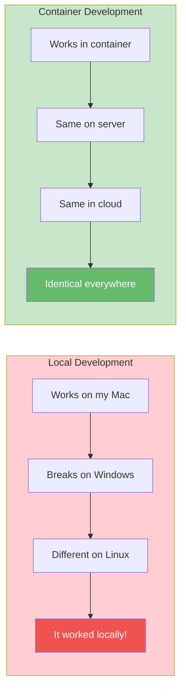

# Benefits

Why use DataSci Homelab instead of running RStudio or Jupyter locally?

---

## The Case for Containerization

### Your Main Machine Stays Clean

Every data science package brings dependencies. Over time, your laptop accumulates:

| Local Installation | DataSci Homelab |
|-------------------|-----------------|
| Multiple R versions competing | Single R version in container |
| Python environment chaos | Isolated Python environment |
| System libraries everywhere | All deps inside container |
| Config files scattered in ~ | Clean home directory |
| "Why did this break?" | Delete container, start fresh |

**With containers:** Your host system remains pristine. Uninstall Docker, and it's like the environment never existed.

---

## Comparison Tables

### Setup Time

| Scenario | Local | DataSci Homelab |
|----------|-------|-----------------|
| Fresh macOS install | 2-4 hours | 10 minutes |
| New team member | 2-4 hours | 10 minutes |
| New laptop | 2-4 hours | 10 minutes |
| Reinstall after break | 1-2 hours | 5 minutes |

### Reproducibility

| Aspect | Local | DataSci Homelab |
|--------|-------|-----------------|
| Same R version across team | Manual coordination | Guaranteed |
| Same package versions | renv/venv helps | Built-in |
| Same system libraries | OS-dependent | Identical |
| Same configuration | Manual | Automatic |
| Works on Linux server | Maybe | Yes |

### Recovery from Disasters

| Disaster | Local Recovery | Container Recovery |
|----------|---------------|-------------------|
| OS update breaks R | Hours of debugging | `docker-compose pull` |
| Python conflicts | Virtual env surgery | Delete volume, reinstall |
| Corrupted installation | Full reinstall | `docker-compose down && up` |
| Need previous version | Good luck | Change image tag |

---

## Specific Advantages

### 1. Multi-Architecture Without Pain

```
Local Reality:
- macOS on M1: "This package doesn't have ARM binaries"
- Windows: "Install Rtools, pray to the gods"
- Linux: "Which distro? Which version?"

DataSci Homelab:
- Pull image
- Works
```

### 2. Remote Access Built-In

RStudio Desktop and JupyterLab are local applications. To access remotely, you need to:

- Set up SSH tunneling
- Configure port forwarding
- Deal with firewall issues
- Hope your laptop doesn't sleep

**DataSci Homelab gives you:**

- Web interfaces by default
- Works from any device with a browser
- Cloudflare Tunnel integration documented
- Access from your phone if needed

### 3. Package Persistence Done Right

| Approach | What Happens |
|----------|-------------|
| conda environments | Works until it doesn't |
| renv | Per-project, extra steps |
| virtualenv | Python only, fragmented |
| DataSci Homelab volumes | Install once, persists forever |

### 4. True Isolation

```r
# Scenario: Testing a new package

# Local approach:
# "Will installing this break my other projects?"
# "Let me create another conda env..."
# "Wait, which env am I in?"

# Container approach:
install.packages("experimental_package")
# If it breaks things: docker-compose down && up
# Your volumes (packages) persist, system resets
```

### 5. Consistent Development → Production Path



---

## When Local Installation Is Better

Be honest about trade-offs:

### Choose Local When:

- **You need GPU access** — Container GPU passthrough is complex
- **You're doing only one thing** — Just R? Just Python? Local may be simpler
- **You have limited disk space** — Docker image is ~8GB
- **You're learning** — Understanding local installation teaches fundamentals
- **You need native performance** — Containers have minimal overhead, but it exists

### Choose DataSci Homelab When:

- You work with both R and Python
- You value reproducibility
- You collaborate with others
- You want remote access
- You're tired of debugging environments
- You deploy to servers

---

## Real-World Scenarios

### Scenario 1: macOS Update

**Local:**
```
1. macOS updates
2. Xcode command line tools break
3. R packages need recompilation
4. Some packages fail mysteriously
5. 4 hours later, mostly working
```

**Container:**
```
1. macOS updates
2. Docker still works
3. docker-compose up
4. Done
```

### Scenario 2: New Team Member

**Local:**
```
1. "Here's our setup doc" (outdated)
2. Install R, specific version
3. Install RStudio
4. Install packages (30 minutes)
5. Fix the three that failed
6. Configure settings
7. Set up Git credentials
8. "Why doesn't this work on my machine?"
```

**Container:**
```
1. git clone
2. ./scripts/setup.sh
3. docker-compose up
4. "Welcome to the team"
```

### Scenario 3: Switching Projects

**Local:**
```
1. Activate correct conda env
2. Wait, which R version does this need?
3. Switch renv
4. Reinstall packages
5. Fix conflicts
```

**Container:**
```
1. cd project-folder
2. docker-compose up
3. Work
```

---

## Performance Comparison

| Metric | Local | Container | Notes |
|--------|-------|-----------|-------|
| Startup time | Instant | ~5 seconds | Container startup |
| CPU performance | 100% | ~99% | Minimal overhead |
| Memory overhead | None | ~50-100MB | Container runtime |
| Disk I/O | Native | ~95-99% | Volume mounts |
| Network | Native | Native | Host networking available |

**The overhead is negligible for data science workloads.**

---

## Cost-Benefit Summary

### Costs

- Docker installation (~500MB)
- Image download (~8GB)
- Learning basic Docker commands
- Slight memory overhead

### Benefits

- Zero environment conflicts
- Reproducible across machines
- Built-in remote access
- Quick disaster recovery
- Easy onboarding
- Clean host system
- Professional workflow

---

## The Bottom Line

> **If you've ever spent an afternoon debugging why a package won't install, DataSci Homelab pays for itself in the first week.**

The containerized approach trades a small upfront learning curve for:

- Hours saved on environment issues
- Confidence in reproducibility
- Freedom from "works on my machine"
- Professional-grade setup without the complexity

---

<div style="text-align: center; margin-top: 3rem;">

**Ready to try it?**

[Get Started](getting-started.md){ .md-button .md-button--primary }

</div>
