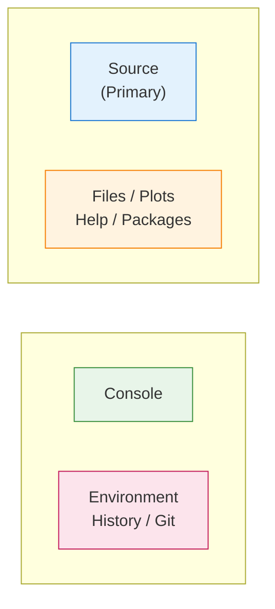

# RStudio Server

Deep dive into the RStudio Server configuration and features.

---

## Overview

RStudio Server provides the full RStudio IDE experience through your web browser. In DataSci Homelab, it's configured with:

- Pre-installed data science packages
- Opinionated but customizable defaults
- Vim keybindings (by default)
- Persistent package storage
- Quarto and LaTeX support

---

## Accessing RStudio

**URL:** [http://localhost:8787](http://localhost:8787)

**Login:**

- Username: Value of `RSTUDIO_USER` in `.env` (default: `rstudio`)
- Password: Value of `RSTUDIO_PASSWORD` in `.env`

---

## Default Configuration

### Editor Settings

| Setting | Value |
|---------|-------|
| Keybindings | Vim |
| Theme | Xcode |
| Font | SF Mono, 13pt |
| Line numbers | Relative |
| Tab width | Auto-detect |

### Code Quality

| Setting | Value |
|---------|-------|
| Rainbow parentheses | Enabled |
| Highlight selected line | Enabled |
| Highlight R function calls | Enabled |
| Show help tooltips | Enabled |

### Saving & Formatting

| Setting | Value |
|---------|-------|
| Auto-save on blur | Enabled |
| Reformat on save | Enabled (Air formatter) |
| Strip trailing whitespace | Enabled |
| Auto append newline | Enabled |
| Line endings | POSIX (LF) |

### Diagnostics

| Setting | Value |
|---------|-------|
| Check function arguments | Enabled |
| Warn on undefined variables | Enabled |
| Warn on unused variables | Enabled |
| Style diagnostics | Enabled |

### Workspace

| Setting | Value |
|---------|-------|
| Save workspace | Never |
| Load workspace | No |
| Restore source documents | No |
| Restore last project | No |

!!! info "Why These Defaults?"
    These settings prioritize reproducibility over convenience. Never saving the workspace ensures your scripts run cleanly from scratch every time.

---

## Pane Layout

The default pane layout is optimized for focused coding:



With an **additional source column** enabled for side-by-side editing.

---

## Package Management

### Installing Packages

```r
# Install from CRAN
install.packages("packagename")

# Install from GitHub
devtools::install_github("user/repo")

# Install from Bioconductor
BiocManager::install("packagename")
```

### Where Packages Are Stored

Packages are installed to `/usr/local/lib/R/site-library`, which is mounted as a Docker volume. This means:

- ✓ Packages persist across container restarts
- ✓ Packages persist across image updates
- ✓ Packages are only lost if you delete the volume

### Checking Installed Packages

```r
# List all packages
installed.packages()

# Check specific package
packageVersion("tidyverse")

# Load package
library(tidyverse)
```

---

## Quarto Integration

Quarto is pre-installed and integrated with RStudio.

### Creating Documents

1. File → New File → Quarto Document
2. Choose format (HTML, PDF, Word)
3. Write your content
4. Click "Render" or use keyboard shortcut

### Rendering from Console

```r
# Render current document
quarto::quarto_render("document.qmd")

# Render to specific format
quarto::quarto_render("document.qmd", output_format = "pdf")
```

### PDF Output

TinyTeX is pre-installed for PDF rendering:

```r
# If you need additional LaTeX packages
tinytex::tlmgr_install("packagename")
```

---

## Database Connections

### PostgreSQL

```r
library(DBI)
library(RPostgres)

con <- dbConnect(
  Postgres(),
  host = "your-host",
  dbname = "your-database",
  user = "your-user",
  password = "your-password"
)

dbListTables(con)
dbGetQuery(con, "SELECT * FROM table LIMIT 10")
dbDisconnect(con)
```

### MySQL

```r
library(DBI)
library(RMySQL)

con <- dbConnect(
  MySQL(),
  host = "your-host",
  dbname = "your-database",
  user = "your-user",
  password = "your-password"
)
```

### DuckDB (Embedded)

```r
library(duckdb)

con <- dbConnect(duckdb(), dbdir = "my_database.duckdb")
dbWriteTable(con, "mtcars", mtcars)
dbGetQuery(con, "SELECT * FROM mtcars WHERE mpg > 20")
dbDisconnect(con)
```

---

## Git Integration

RStudio has built-in Git support:

### Setup

```r
# Configure git (first time only)
usethis::use_git_config(
  user.name = "Your Name",
  user.email = "your@email.com"
)

# Set up GitHub credentials
gitcreds::gitcreds_set()
```

### Daily Workflow

1. **Git pane** (top-right by default) shows changed files
2. **Stage** files by checking boxes
3. **Commit** with message
4. **Push/Pull** using toolbar buttons

### From Console

```r
# Initialize a repo
usethis::use_git()

# Create GitHub repo
usethis::use_github()
```

---

## Keyboard Shortcuts

With Vim keybindings enabled:

### Normal Mode

| Key | Action |
|-----|--------|
| `Ctrl+Shift+Enter` | Run current line/selection |
| `Ctrl+Enter` | Run line, advance |
| `Ctrl+Shift+S` | Source entire file |
| `Ctrl+Shift+K` | Render document |
| `Ctrl+.` | Go to file/function |

### Navigation

| Key | Action |
|-----|--------|
| `Ctrl+1` | Move focus to Source |
| `Ctrl+2` | Move focus to Console |
| `Ctrl+Shift+O` | Document outline |
| `Ctrl+Shift+F` | Find in files |

---

## Customization

### Changing Preferences

1. Tools → Global Options
2. Make your changes
3. Click OK

Changes are saved to `~/.config/rstudio/rstudio-prefs.json`.

### Syncing to Repository

To persist your preferences:

```bash
cp volumes/home/.config/rstudio/rstudio-prefs.json \
   config-overrides/rstudio-config/
git add config-overrides/rstudio-config/rstudio-prefs.json
git commit -m "Update RStudio preferences"
```

See [Customization](customization.md) for more details.

---

## Troubleshooting

### RStudio Won't Load

```bash
# Check if the service is running
docker-compose logs homelab | grep -i rstudio

# Restart the container
docker-compose restart
```

### Package Installation Fails

```r
# Check for system dependencies
# Many R packages need system libraries

# Inside container, install system deps:
# sudo apt-get install libcurl4-openssl-dev
```

### Blank Screen / Session Crash

```bash
# Clear RStudio session files
rm -rf volumes/home/.local/share/rstudio/sessions/*
docker-compose restart
```

### Password Not Working

```bash
# Reset password
docker-compose exec homelab bash -c 'echo "$RSTUDIO_USER:newpassword" | chpasswd'
```
